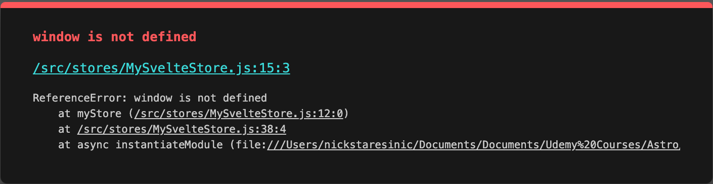

# How can I get `window` in an `.mdx` file?

[](https://stackblitz.com/edit/astro-jtddy8?file=README.md)


- ✅ `Test.svelte` persists a Svelte store to local storage using the `window` object.
- ✅ I can import & use `Test.svelte` in `/src/pages/good-to-go.astro` with the <a href="https://docs.astro.build/en/reference/directives-reference/#clientonly" target="_blank" rel="noopener noreferrer">`client:only`</a> directive, <a href="https://docs.astro.build/en/guides/troubleshooting/#common-cause" target="_blank" rel="noopener noreferrer">as per the docs</a>:

```
  import Test from "../components/Test.svelte";

  <Test client:only />
```

- ✅ But when I run the same code in `/src/pages/no-go.mdx`, I get the <mark>"Window is not defined"</mark> error:



- ✅ (Svelte components that don't depend on `window` run as expected in a `.mdx` file.)

# How can I get `window` in the `.mdx` file?